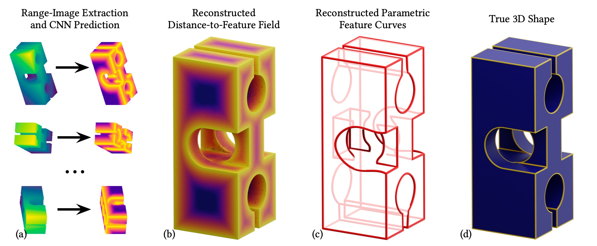

# DEF: Deep estimation of sharp geometric features in 3D shapes

### Using the code
**SIGGRAPH 2022 [[Project Page](https://artonson.github.io/publications/def)] [[Arxiv](https://arxiv.org/abs/2011.15081)] [[Bibtex](docs/bib.bib)]**

This is an official implementation of the paper 
_Albert Matveev, Ruslan Rakhimov, Alexey Artemov, Gleb Bobrovskikh, Vage Egiazarian, Emil Bogomolov, Daniele Panozzo, Denis Zorin, and Evgeny Burnaev. "DEF: Deep estimation of sharp geometric features in 3D shapes". ACM Trans. Graph. 41, 4, Article 108 (July 2022), 22 pages._




## :construction: Construction Alert! :construction:

We are currently in the process of updating and release the source code for our project. 
As soon as we finish this housekeeping, this message will disappear.
If you would like to use our method now, please email the corresponding authors of the paper.


## Getting started
Below, we enumerate the major steps required for our method to work, and 
provide the links to the respective documentation. To get familiar with more
details of how our method works, please refer to the respective documentation
pages, the source code, contact the authors via [artonson at yandex ru],
or [open an issue](https://github.com/artonson/def/issues/new).
 * [System installation and configuration](docs/install.md)
 * [Generating synthetic training datasets](docs/synthetic_data.md)
 * [Generating real-world training datasets](docs/real_data.md)
 * [Training point-based and image-based DEF networks](https://github.com/artonson/def/blob/main/docs/training.md)
 * [Running inference with a pre-trained DEF network](https://github.com/artonson/def/blob/main/docs/inference.md)
 * [Running reconstruction on complete 3D models](https://github.com/artonson/def/blob/main/docs/fusion.md)
 * [Running extraction of parametric curves](https://github.com/artonson/def/blob/main/docs/parametric.md)


## Pre-trained models
We provide a variety of pre-trained DEF networks (both image-based and point-based).
The table below summarizes these models and provides links for downloading 
the respective weight files.

| **Link** | **Modality**  | **Resolution** | **Noise level** | **Trained on** | 
|----------|---------------|----------------|-----------------|----------------|
 | [x](y)   | Image-based   | 0.02           |                 | DEF-Sim |


## Training and evaluation datasets
See also [Synthetic data](docs/synthetic_data.md) and 
[Real-world data](docs/real_data.md) pages.


## Citing
```
@article{10.1145/3528223.3530140,
author = {Matveev, Albert and Rakhimov, Ruslan and Artemov, Alexey and Bobrovskikh, Gleb and Egiazarian, Vage and Bogomolov, Emil and Panozzo, Daniele and Zorin, Denis and Burnaev, Evgeny},
title = {DEF: Deep Estimation of Sharp Geometric Features in 3D Shapes},
year = {2022},
issue_date = {July 2022},
publisher = {Association for Computing Machinery},
address = {New York, NY, USA},
volume = {41},
number = {4},
issn = {0730-0301},
url = {https://doi.org/10.1145/3528223.3530140},
doi = {10.1145/3528223.3530140},
journal = {ACM Trans. Graph.},
month = {jul},
articleno = {108},
numpages = {22},
keywords = {curve extraction, sharp geometric features, deep learning}
}
```

## Acknowledgements

We are grateful to Prof. Dzmitry Tsetserukou (Skoltech) and his laboratory 
staff for providing the 3D printing device and technical support. We thank 
Sebastian Koch (Technical University of Berlin), Timofey Glukhikh (Skoltech) 
and Teseo Schneider (New York University) for providing assistance in 
data generation. We also thank Maria Taktasheva (Skoltech) for assistance 
in computational experiments. We acknowledge the use of computational 
resources of the Skoltech CDISE supercomputer Zhores for obtaining the 
results presented in this paper. The work was supported by the Analytical 
center under the RF Government (subsidy agreement 000000D730321P5Q0002, 
Grant No. 70-2021-00145 02.11.2021).
